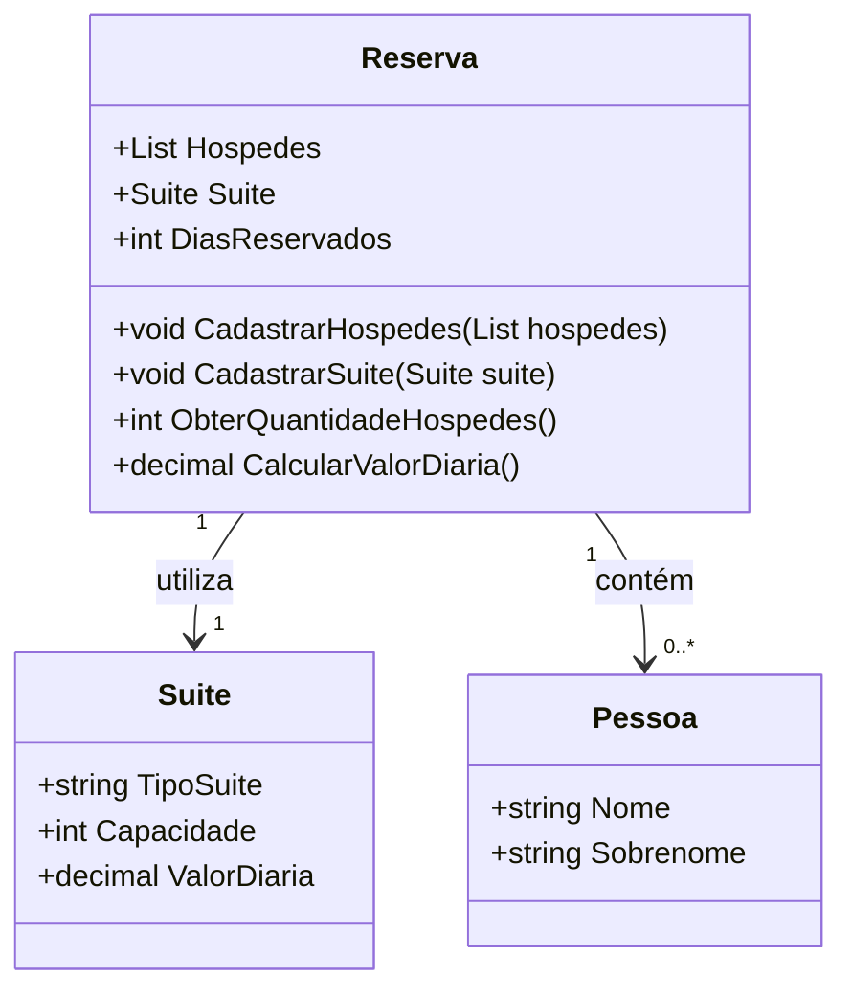

# 🏨 Sistema de Hospedagem de Hotel  

> Desafio da trilha **.NET da DIO** – Módulo *Explorando a linguagem C#*  

---

## 📌 Desafio
Você foi contratado para construir um sistema de hospedagem, que será usado para realizar uma reserva em um hotel.  

O sistema deve conter:  
- Uma classe **Pessoa** (representa o hóspede).  
- Uma classe **Suíte**.  
- Uma classe **Reserva** (faz o relacionamento entre as duas anteriores).  

### 🎯 Regras e validações
- Não deve ser possível realizar uma reserva de uma suíte com **capacidade menor do que a quantidade de hóspedes**.  
  > Exemplo: Se é uma suíte para 2 pessoas, ao tentar cadastrar 3 hóspedes deve lançar uma **Exception**.  

- O método `ObterQuantidadeHospedes` deve retornar a quantidade total de hóspedes.  

- O método `CalcularValorDiaria` deve retornar o valor total (dias reservados × valor da diária).  

- Caso a reserva seja **igual ou maior que 10 dias**, deve ser aplicado **10% de desconto**.  

---

## ✅ Solução
Recriei o projeto **do zero**, garantindo:  
✔️ Validação da capacidade da suíte em relação ao número de hóspedes  
✔️ Cálculo correto da quantidade de hóspedes  
✔️ Cálculo do valor total da diária  
✔️ Aplicação do desconto de 10% em reservas de 10 dias ou mais  
✔️ Código organizado e didático, seguindo boas práticas de programação em C#  

---

## 📂 Classe Reserva (exemplo)

```csharp
namespace ProjetoHospedagem.Models;

internal class Reserva
{
    public List<Pessoa> Hospedes { get; set; }
    public Suite? Suite { get; set; }
    public int DiasReservados { get; set; }

    public Reserva() { }

    public Reserva(int diasReservados)
    {
        DiasReservados = diasReservados;
    }

    public void CadastrarHospedes(List<Pessoa> hospedes)
    {
        if (Suite == null)
            throw new Exception("É necessário cadastrar uma suíte antes de cadastrar hóspedes.");

        if (hospedes.Count <= Suite.Capacidade)
            Hospedes = hospedes;
        else
            throw new Exception("A quantidade de hóspedes excede a capacidade da suíte.");
    }

    public void CadastrarSuite(Suite suite)
    {
        Suite = suite;
    }

    public decimal CalcularValorDiaria()
    {
        decimal valor = DiasReservados * Suite.ValorDiaria;

        if (DiasReservados >= 10)
            valor -= valor * 0.10M; // Desconto de 10%

        return valor;
    }

    public int ObterQuantidadeHospedes()
    {
        return Hospedes.Count;
    }
}
````

---

## 📊 Diagrama de Classes



---

## ▶️ Exemplo de Uso (Program.cs)

```csharp
using ProjetoHospedagem.Models;

// Criando hóspedes
List<Pessoa> hospedes = new List<Pessoa>
{
    new Pessoa { Nome = "Fulano", Sobrenome = "Santos" },
    new Pessoa { Nome = "Beltrano", Sobrenome = "Silva" }
};

// Criando suíte
Suite suite = new Suite
{
    TipoSuite = "Premium",
    Capacidade = 2,
    ValorDiaria = 100.0M
};

// Criando reserva
Reserva reserva = new Reserva(diasReservados: 12);
reserva.CadastrarSuite(suite);
reserva.CadastrarHospedes(hospedes);

// Exibindo informações
Console.WriteLine($"Hóspedes: {reserva.ObterQuantidadeHospedes()}");
Console.WriteLine($"Valor diária: {reserva.CalcularValorDiaria()}");
```

### 📌 Saída esperada:

```
Hóspedes: 2
Valor total da reserva: R$ 1.080,00
```

---

## ⚡ Como executar o projeto

### 🔧 Pré-requisitos

* [.NET 8 SDK](https://dotnet.microsoft.com/en-us/download) ou superior
* Um editor de código como [Visual Studio Code](https://code.visualstudio.com/) ou [Visual Studio](https://visualstudio.microsoft.com/)

### ▶️ Passo a passo

1. Clone este repositório:

   ```bash
   git clone https://github.com/vandersant7/DesafioProjetoHospedagem.git
   ```
2. Acesse a pasta do projeto:

   ```bash
   cd projeto-hospedagem-hotel
   ```
3. Restaure as dependências (se houver):

   ```bash
   dotnet restore
   ```
4. Compile o projeto:

   ```bash
   dotnet build
   ```
5. Execute a aplicação:

   ```bash
   dotnet run
   ```

---

## 🚀 Tecnologias utilizadas

* C# 12
* .NET 8
* Programação Orientada a Objetos (POO)

---

## 👨‍💻 Autor

Feito com 💙 por **Evandro Santos**
🔗 [LinkedIn](https://www.linkedin.com/in/evandrojsantos) | 🔗 [GitHub](https://github.com/vandersant7)
